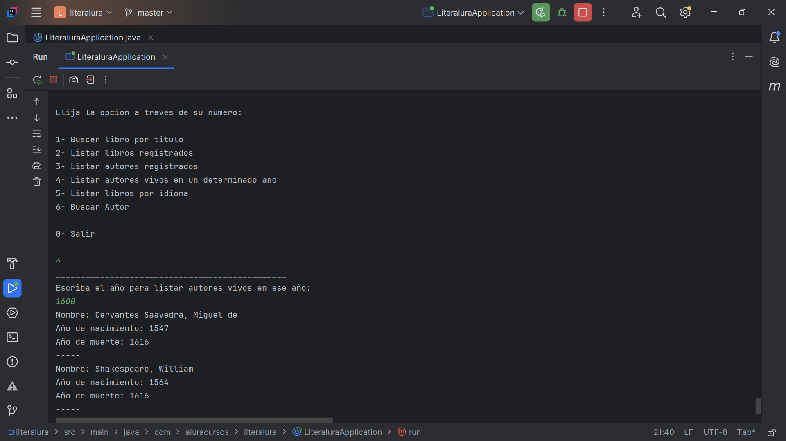

# Literalura

## Descripción

El presente proyecto forma parte del desafío de programación de Alura. Se llama Literalura y consiste en un catálogo de libros. Con este proyecto sencillo se busca desarrollar y adquirir competencias para realizar solicitudes a una API de libros, manipular datos JSON, guardarlos en una base de datos y, finalmente, filtrar y mostrar los libros y autores de interés. Es una aplicación de consola enfocada en el backend.

## Objetivo

Desarrollar un catálogo de libros que permita interacción textual (vía consola) con los usuarios, ofreciendo al menos cinco opciones de interacción. Los libros se buscarán a través de una API específica: [Gutendex](https://gutendex.com/).

## Pasos para completar el desafío

1. Configuración del ambiente Java.
2. Creación del proyecto.
3. Consumo de la API.
4. Análisis de la respuesta JSON.
5. Inserción y consulta en la base de datos.
6. Exhibición de resultados a los usuarios.

## Tecnologías utilizadas

- IDE IntelliJ
- Spring Boot v3.4.1
- Java 17
- Maven
- PgAdmin4
- Entre otros...

---
